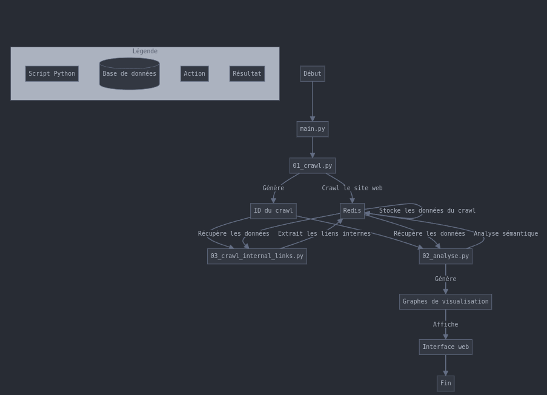

# SEO Analyse

Ce projet est une application d'analyse sémantique et de visualisation de liens internes d'un site web. Il utilise des crawlers pour extraire le contenu des pages web, analyse les données sémantiques et visualise les résultats sous forme de graphes interactifs.

## Fonctionnalités

1. **Crawl de sites web** : Extraction du contenu des pages web.
2. **Analyse sémantique** : Détermination des thématiques dominantes à partir du contenu.
3. **Visualisation des liens internes** : Affichage des liens internes sous forme de graphes interactifs.
4. **Clusterisation** : Regroupement des pages en clusters basés sur le contenu sémantique.
5. **Assignation de couleurs de cluster** : Harmonisation des couleurs pour une meilleure visualisation.


## Fonctionnement de l'application

L'application de Visualisation Sémantique fonctionne en plusieurs étapes interconnectées, comme illustré dans le schéma ci-dessous :



Ce schéma montre le flux de travail de l'application :

1. Le script principal `main.py` orchestre l'ensemble du processus.
2. `01_crawl.py` crawle le site web et stocke les données dans Redis.
3. `03_crawl_internal_links.py` extrait les liens internes des pages crawlées.
4. `02_analyse.py` effectue l'analyse sémantique des données.
5. Les résultats sont utilisés pour générer des graphes de visualisation.
6. Ces graphes sont présentés via une interface web interactive.

Redis joue un rôle central dans ce processus, servant de stockage intermédiaire pour les données à chaque étape. Cette architecture permet une analyse efficace et une visualisation dynamique des résultats.


## Prérequis

- Python 3.7 ou supérieur
- Redis
- Les bibliothèques Python suivantes :
  - `redis`
  - `trafilatura`
  - `beautifulsoup4`
  - `sentence-transformers`
  - `sklearn`
  - `matplotlib`
  - `mpld3`
  - `nltk`

## Installation

Créeez un environnement virtuel : 
   ```sh
   python3 -m venv venv
   source venv/bin/activate
   ```
1. Clonez le dépôt GitHub :
   ```sh
   git clone https://github.com/friteuseb/seoanalyse.git
   cd seoanalyse
   ```

2. Installez les dépendances :
   ```sh
   pip install -r requirements.txt
   ```

3. Assurez-vous que Redis est installé et en cours d'exécution.

4. Téléchargez les stopwords français pour NLTK :
   ```sh
   python -m nltk.downloader stopwords
   ```

## Utilisation

### Crawling d'un site web

Pour lancer un crawl d'un site web et extraire le contenu des pages :
```sh
python3 01_crawl.py <URL>
```

### Analyse des liens internes

Pour analyser les liens internes d'un crawl spécifique :
```sh
python3 03_crawl_internal_links.py <crawl_id> <CSS Selector>
```

### Analyse sémantique

Pour réaliser une analyse sémantique et déterminer les clusters :
```sh
python3 02_analyse.py <crawl_id>
```

### Lancement de l'application principale

Pour lancer l'application principale qui inclut toutes les étapes ci-dessus :
```sh
python3 main.py <URL> <CSS Selector>
```

### Visualisation des résultats

Les résultats sont sauvegardés dans Redis et peuvent être visualisés via des graphiques interactifs générés par D3.js et HTML.

## Structure du projet

- `01_crawl.py` : Script de crawling des sites web.
- `02_analyse.py` : Script d'analyse sémantique et de clusterisation.
- `03_crawl_internal_links.py` : Script d'analyse des liens internes et mise à jour des fichiers JSON.
- `main.py` : Script principal pour lancer toutes les étapes de l'analyse.
- `script.js` : Script JavaScript pour la visualisation des graphes interactifs.
- `style.css` : Fichier CSS pour le style de la page de visualisation.
- `requirements.txt` : Liste des dépendances Python.

## Contribution

Les contributions sont les bienvenues ! Veuillez soumettre des issues et des pull requests pour toute amélioration ou bug.

## Licence

Ce projet est sous licence MIT. Voir le fichier [LICENSE](LICENSE) pour plus de détails.
